# Cooperative browser access

A user authorizes a Codex task. Maria can then perform browser operations on that
user's behalf. This remains automated interaction; authorization does not establish
how ChatGPT will classify the traffic or what access its service will permit.
Maria cannot label an unknown service decision a false positive or guarantee that
an account will never be restricted.

## Execution rules

```mermaid
stateDiagram-v2
  [*] --> Ready
  Ready --> Preparing: Original Codex request
  Preparing --> Accepted: Spaced, ownership-checked Send
  Accepted --> Completed: Response observed
  Accepted --> NeedsReview: Uncertain or failed response
  Ready --> Paused: Service access signal
  Preparing --> Paused: Service access signal
  Paused --> Ready: User resumes after any cooldown
  NeedsReview --> [*]: Preserve original chat; never replay
```

- A browser-profile gate handles explicit Cloudflare challenge headers, backend
  HTTP 429, backend HTTP 401, and conversation-endpoint HTTP 503. It considers only
  this launcher's owned ChatGPT surfaces. An ordinary permission-related 403 or a
  third-party resource failure is not classified as a verification challenge.
  Challenge detection uses the `cf-mitigated: challenge` header independently of
  the HTTP status, following [Cloudflare's documented signal](https://developers.cloudflare.com/cloudflare-challenges/challenge-types/challenge-pages/detect-response/).
- Rate-limit dialogs remain visible and produce terminal errors. Structured errors
  after Send activation or acceptance also become terminal, even when a lower
  layer incorrectly labels them retryable.
- The gate is checked before allocating a turn and again before Send. It spaces
  automatic sends by two seconds across the profile to prevent bursts. This is a
  deterministic traffic budget, not an attempt to imitate human behavior.
- A pause invalidates queued send reservations. Explicit resume allows a new
  request; it cannot release old reservations or replay accepted prompts.
- Retry-After seconds and HTTP dates set the earliest resume time. A later signal
  cannot shorten it. Without a server time, the initial cooldown is one minute.
  Persistent incident responses back off up to fifteen minutes. Expiry alone does
  not resume work.
- Mixed failures within an active cooldown count as one incident. Verification
  takes precedence over sign-in, rate limits, and service failures. Secondary
  failures keep the original review page; an explicit later server deadline can
  still extend the wait. A new failure after the cooldown can increase backoff.
- Cancelled reservations fail before waiting. Send admission rechecks ownership,
  interaction mode, and pause state after the asynchronous pacing handoff.
- Challenges are never automatically reloaded or solved. Users review the existing
  ChatGPT surface and complete any check themselves. Successful background assets
  cannot clear the pause. Startup authentication refresh is skipped while paused.
- Manual mode keeps its existing no-DOM-automation boundary. A pause already known
  to this browser profile also applies to starting a new manual handoff.
- Native Codex routing does not depend on this gate. Users can keep working with a
  native model while Web access needs attention.

## Ownership and diagnostics

The private `runtime/browser-access.json` file stores only the reason, detection
time, cooldown, and incident count. It contains no cookies, transcript, browser
fingerprint, account identifier, or capability token. Corrupt state becomes a local
pause rather than a claim that ChatGPT issued a challenge. Writes and repeated
incident notifications are coalesced.

Activity records the reason, HTTP status, and bounded x-request-id/cf-ray references
when the service supplies them. Those references can help support distinguish an
access problem from an application failure. Diagnostics remain local until the user
exports and shares them. A user resume records an acknowledgement, not a claim that
Maria verified or overruled the service's decision.

There is no fingerprint camouflage, proxy rotation, CAPTCHA solving, account
rotation, or attempt to defeat service safeguards in this change. The pre-existing
passkey session capture uses an offline isolated Chrome process; it does not send
requests to remote sites during capture.

OpenAI's [computer-use guide](https://developers.openai.com/api/docs/guides/tools-computer-use)
recommends preserving the execution environment, applying permission boundaries,
bounding runs, supporting cancellation, and verifying outcomes. It is guidance for
computer-use integrations, not an exemption for ChatGPT Web traffic.

## Verification

Tests cover persistent pauses, server cooldowns, owned-surface classification,
challenge pages without reloads, deterministic send spacing, cancellation and
pause/resume races, terminal rate limits, and typed post-Send errors. Renderer
checks exercise the paused banner, disabled early resume, and explicit recovery.
No real ChatGPT prompt or verification challenge is submitted for these tests.
